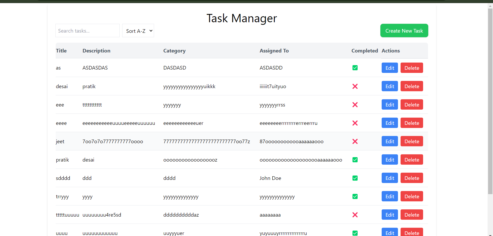
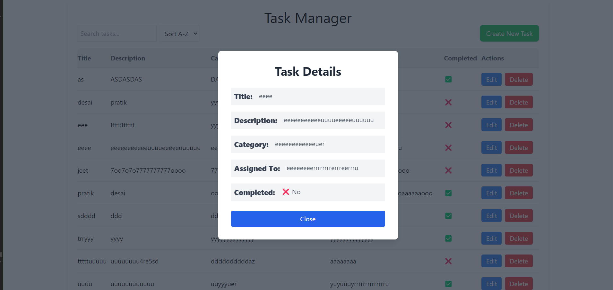

# Task Manager - (Create React App)

## Available Scripts

In the project directory, you can run:

### `npm run dev`

Runs the app in the development mode.\
Open [http://localhost:3000](http://localhost:3000)

### `npm test`

Launches the test runner in the interactive watch mode.\
See the section about [running tests](https://facebook.github.io/create-react-app/docs/running-tests) for more information.

### `npm run build`

Builds the app for production 

### `npm run eject`

**Note: this is a one-way operation. Once you `eject`, you can't go back!**

